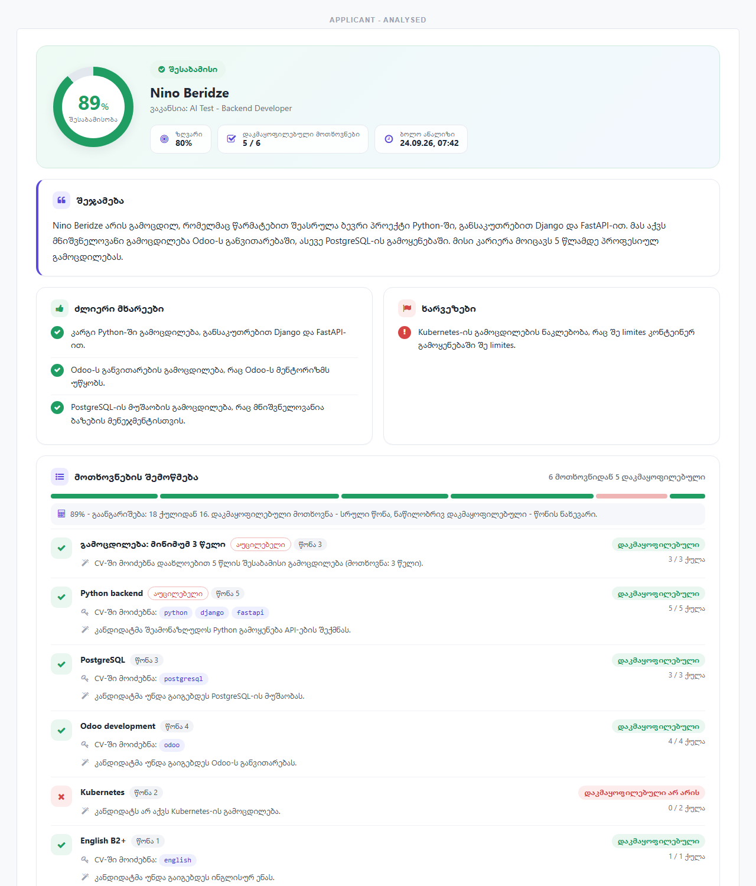
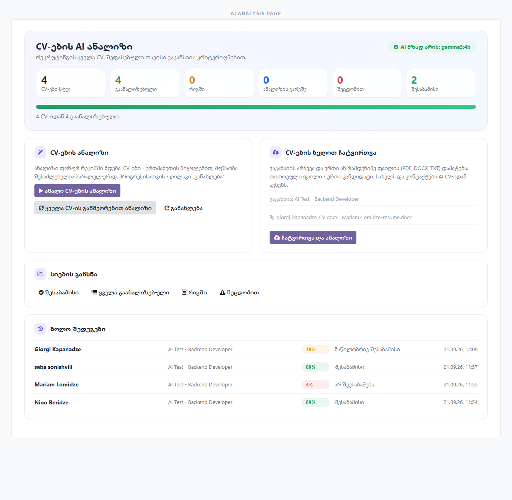
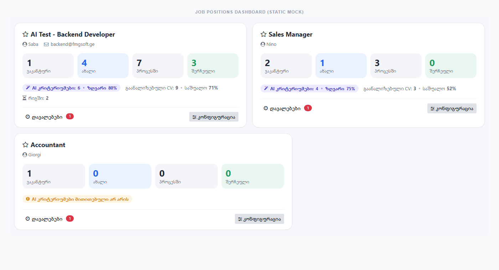
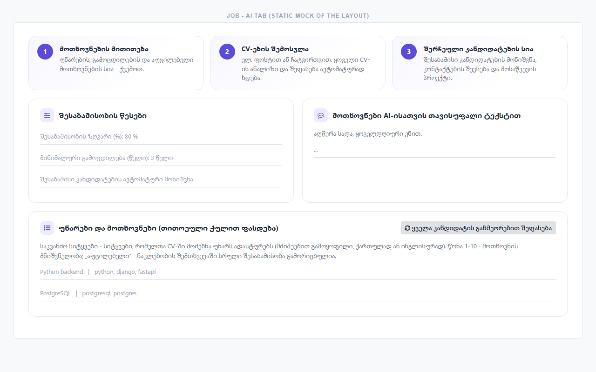

# AI CV Screening for Odoo 19 (local, free)

An Odoo 19 Recruitment add-on that reads incoming CVs with a **free, local AI**
(Ollama), scores them against each job's requirements with verified evidence, fills in
the applicant, flags the matches and drafts the invitation. No API key, no cost per CV,
no CV ever leaves your server. Fully translated into Georgian.

| | |
|---|---|
|  |  |
| The applicant's AI report: one percentage, its arithmetic, evidence per requirement | The AI analysis page: totals, progress, bulk upload, "analyse everything" |
|  |  |
| Job positions dashboard | A job's criteria: skills with keywords, weights and must-haves |

**Documents:** [INSTALL.md](INSTALL.md) (installing on a real Odoo 19 or another
computer) · [HOW_IT_WORKS.md](HOW_IT_WORKS.md) (the whole pipeline, top to bottom).

**Quick install from this repository** into an Odoo addons directory (the folder must be
named `hr_recruitment_ai`):

```bash
cd /path/to/your/custom_addons
git clone https://github.com/SabaSoni/AI-CV-Screening-module-for-Odoo-19.git hr_recruitment_ai
pip install -r hr_recruitment_ai/requirements.txt
hr_recruitment_ai/scripts/setup_ollama.sh      # Windows: scripts\setup_ollama.ps1
```

Then restart Odoo and install **AI CV Screening** from *Apps*.

> **Installing on another computer?** Follow [INSTALL.md](INSTALL.md): copy this folder,
> `pip install -r requirements.txt`, run `scripts/setup_ollama.ps1` (Windows) or
> `scripts/setup_ollama.sh` (Linux/macOS), install the module. Your data moves with an
> Odoo database backup.

Screens applicant CVs against a job's requirement list using a **free, local**
engine. No API keys, no credits, and CV data never leaves your machine.

What happens when a CV lands on an applicant (e-mail alias, chatter upload, API):

1. **Text extraction** - PDF (pypdf), DOCX (python-docx), TXT.
2. **Contacts by regex** - email, phone (Georgian `+995` aware), LinkedIn, name.
   Deterministic, instant, never invents data.
3. **Requirement matching** - every requirement on the job is checked three ways:
   - exact **keywords** in the CV,
   - **semantic similarity** with a multilingual embedding model (`bge-m3`),
   - the local **LLM's** judgment (`gemma3:4b` by default) with a JSON schema.
   The model's opinion only counts when the CV backs it: it must quote the CV, the
   quote is verified, and when none of your keywords is in the CV it can give half
   credit at most. There is **one** percentage: points gained / all points (met = full
   weight, partly met = half), shown with its arithmetic on the report. A missing
   "must have" caps the result at *Partial match*. See `HOW_IT_WORKS.md`.
4. **Auto-fill & flag** - if the score is at or above the job's threshold (80 % by
   default): name / email / phone / LinkedIn are filled from the CV, the applicant
   gets the **AI Match** tag, a higher priority, a **"Contact candidate"** activity,
   optionally a stage move, and a personalised invitation e-mail (Georgian by
   default, from a fixed template so the wording is always correct; a setting lets
   the model write it instead). Click **Contact candidate** on the applicant to
   open the composer pre-filled.

Everything except the LLM/embedding step also works with Ollama switched off,
so keyword matching and contact extraction never depend on a model.

## 1. Install Ollama and the models (once)

```powershell
winget install --id Ollama.Ollama -e
ollama pull gemma3:4b     # chat model, ~3.3 GB, fits the RTX 4050 fully
ollama pull bge-m3        # multilingual embeddings, ~1.2 GB
```

Ollama starts automatically with Windows and listens on `http://127.0.0.1:11434`.

Model options (change in Settings, then pull with `ollama pull <name>`):

| Model        | VRAM  | Notes                                                |
|--------------|-------|------------------------------------------------------|
| `gemma3:4b`  | ~4 GB | Default. Fast, decent Georgian.                      |
| `qwen3:8b`   | ~6 GB | Smarter; tick "Disable thinking mode" in Settings.   |
| `gemma3:12b` | ~9 GB | Best quality; spills to CPU RAM on a 6 GB card (slow). |

## 2. Install the module

Odoo already has `pypdf`, `python-docx` and `requests`. In Odoo:
*Apps > Update Apps List > "AI CV Screening" > Install* (Recruitment is installed
automatically). Or from a terminal:

```powershell
odoo-bin -c odoo.conf -d <database> -i hr_recruitment_ai --stop-after-init --no-http
```

Then *Recruitment > Configuration > Settings > AI CV Screening > Test connection*.

## Georgian interface

The module ships a full Georgian translation (`i18n/ka.po`). Odoo 19's own Georgian
translation of Recruitment is almost empty, so the module also translates the core
screens recruiters use (job dialog, applicant form, stages, menus) from
`data/i18n_core/ka.po`; it imports that file on every install or update when Georgian
is an active language. Switch a user to Georgian in *Preferences > Language*.
Both files were checked with a Hunspell Georgian dictionary and a script that rejects
any letter outside the Georgian and basic Latin alphabets.

## 3. Configure a job

*Recruitment > Job Positions > (job) > AI Screening tab.*

| Column       | Meaning                                                                  |
|--------------|--------------------------------------------------------------------------|
| Requirement  | What must be shown, e.g. "Python backend development".                   |
| Keywords     | Comma-separated proof words: `python, django, flask`. Empty = the name.  |
| Weight       | 1-10 importance. The % is a weighted average.                            |
| Must have    | If missing, the applicant can only be a *Partial match*.                 |
| Details      | Extra guidance for the AI, e.g. "3+ years commercial, not just courses". |

The same criteria are on the quick **Create a Job Position** dialog: job description,
free-text requirements (education, languages, soft skills...), **minimum experience
in years** (a must-have the AI judges from the CV), the threshold and the skill list.
The description and the free-text requirements are given to the AI as context.

Set the **threshold** (default 80 %) and optionally a **stage** to move matches to.
**Re-evaluate all applicants** queues every applicant with a CV after you change
the requirements.

## Receiving CVs by e-mail (one-time setup)

The AI never reads a mailbox. Odoo's own mail gateway decides which e-mails become
applicants; the module then screens the CV files attached to those applicants only.

1. Use a **dedicated mailbox** for applications, e.g. `jobs@yourcompany.ge`. Never
   connect a personal or general inbox: every mail in the connected mailbox is treated
   as an application.
2. *Settings > Technical > Incoming Mail Servers > New*: IMAP host, login and password
   of that mailbox (for Gmail / Microsoft 365 use an app password or OAuth). Set
   *Create a New Record* to **Applicant**. Click *Test & Confirm*. Odoo fetches every
   few minutes.
3. Optional, to route by vacancy: *Settings > General Settings > Alias Domain* =
   `yourcompany.ge`, then give each job an alias on its form (e.g. `accountant`). Mails
   sent to `accountant@yourcompany.ge` land on that job and are scored against its
   criteria. Mails to the general address become applicants without a job; pick the job
   and click *Analyze CV (AI)*.
4. *Settings > Technical > Outgoing Mail Servers*: SMTP of the same mailbox, so the
   drafted invitation can actually be sent.

Only attachments that look like a CV (PDF, DOCX, TXT) trigger the analysis; an e-mail
without such a file creates the applicant but is not analysed.

## Uploading CVs by hand and analysing everything

**Recruitment > AI analysis** is the module's own page:

- **Numbers**: CVs in total, analysed, in the queue, not analysed, failed, matches, a
  progress bar and the state of the AI engine (ready / model missing / not reachable).
- **Upload CVs by hand**: choose the job, add one or many PDF / DOCX / TXT files, press
  *Upload and analyse*. Every file becomes an applicant. Its name starts as the cleaned
  file name and is replaced by the name the AI reads in the CV; e-mail, phone and
  LinkedIn are filled in too.
- **Analyse new CVs** queues every CV that was never analysed or failed;
  **Re-analyse every CV** redoes all of them (use it after changing a job's criteria).
- **Open the lists**: matches, all analysed, the queue, failed.

The analysis always runs in the background job, one CV after another, and the job keeps
going until the queue is empty, so the page never freezes; press *Refresh* to follow it.

A single CV can also be uploaded on the applicant form itself, with the *Upload a CV*
control next to the AI buttons under the applicant's name.

## 4. Daily use

- New CVs are analysed right away by the module's background worker, one after
  another. (The scheduled action "Recruitment AI: screen queued CVs" is only a
  watchdog that restarts the worker when CVs are waiting.)
- On an applicant, **Analyze CV (AI)** runs it immediately. The **AI Screening**
  tab shows the score, per-requirement evidence, summary, gaps and the e-mail draft.
- Private notes on the applicant (the *Note* tab) are passed to the AI as
  recruiter notes, e.g. "must be able to start in October".
- Kanban cards and the list view show the AI % and verdict; filters
  *AI: Match / Partial / No match* and *Group by AI Verdict* are in the search.

## Look and feel

The module has its own stylesheet (`static/src/scss/hr_recruitment_ai.scss`, classes
prefixed `o_hrai_`). The applicant's AI tab is a visual report rendered by
`models/hr_applicant_report.py`: score ring and verdict, key figures, summary,
strengths / gaps with icon bullets, and a requirement checklist (status icon, must-have
and weight chips, the keywords found in the CV as chips, the AI's explanation). It has
friendly empty, queued and error states. The job's AI tab and the quick-create dialog
use the same cards plus a three-step "how it works" strip.

The lists are cleaned deterministically: several gaps about the same technology are
merged into one, an item containing a garbled word is dropped whole, and a summary the
model wrote in the wrong language is translated by a second short call.

## Engine self-test (no Odoo needed)

```powershell
# use the Python that runs Odoo (Windows installer: "C:\Program Files\Odoo 19.0.<build>\python\python.exe")
python tools\selftest.py
python tools\selftest.py path\to\some_cv.pdf
```

## Notes and limits

- **Scanned PDFs** (images) contain no text. OCR (tesseract + `kat` language pack)
  is a separate install; the engine log tells you when a PDF looks scanned.
- Legacy **.doc** files are not parsed; re-save as .docx or PDF.
- Small local models are weaker in Georgian than in English: `gemma3:4b` writes a
  readable Georgian summary but with occasional grammar or spelling slips. Scores
  and requirement checks are language-neutral and unaffected. What the module does
  about it, all deterministic (`tools/textfix.py`): the candidate's name is pinned in
  the prompt, and if the model still mangles it in Georgian letters the exact CV
  spelling is restored ("ბერძიძეს" becomes "Beridze-ს"); words from other alphabets
  or languages are removed unless they literally occur in the CV; and the invitation
  e-mail uses a fixed Georgian template, so it is always correct. For a
  cleaner summary switch the chat model to `gemma3:12b` (slower) or set the language
  to English. The optional "proofread" second pass is off by default: measured with
  the 4B model it fixed no spelling and re-mangled names.
- The embedding layer is deliberately conservative (it only counts clear semantic
  matches). Keywords and the LLM carry most decisions; put good synonyms in the
  *Keywords* column for reliable results.
- Speed: on the RTX 4050 a screening takes about 10-15 seconds once the model is
  loaded (first call after idle adds ~20 s). On CPU only it takes 1-3 minutes; the
  background worker handles that; "Analyze CV" waits up to 90 seconds and then tells
  you to refresh. The analysis never runs inside a web request, so Odoo's two-minute
  limit (which would restart the server) cannot be hit.
- Lenovo hybrid graphics: on battery the laptop may switch the NVIDIA GPU off
  entirely, and Ollama silently falls back to the CPU. Plug in the charger (or set
  the GPU mode in Lenovo Vantage). `ollama ps` shows a PROCESSOR column with
  "100% GPU" when it is right.
- Small VRAM: the chat model (about 4.4 GB at an 8192-token context) and the
  embedding model do not both fit on a 6 GB card, which made Ollama reload a model
  on every CV. The setting "Run the embedding model on the CPU" (on by default)
  avoids that; embedding a CV on the CPU takes well under a second.
